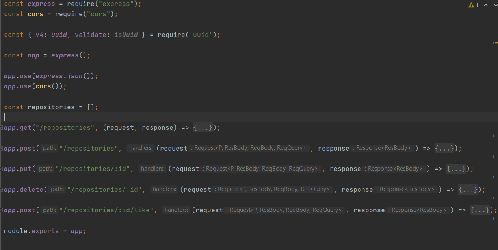
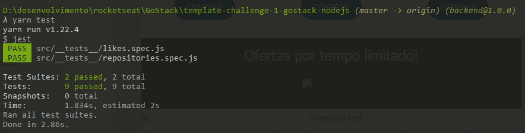

  <a href="#rocket-tecnologias">Tecnologias</a>&nbsp;&nbsp;&nbsp;|&nbsp;&nbsp;&nbsp;
  <a href="#-projeto">Projeto</a>&nbsp;&nbsp;&nbsp;|&nbsp;&nbsp;&nbsp;
    <a href="#-rotas">Rotas</a>&nbsp;&nbsp;&nbsp;|&nbsp;&nbsp;&nbsp;
  <a href="#-como-rodar">Como rodar</a>&nbsp;&nbsp;&nbsp;|&nbsp;&nbsp;&nbsp;
  <a href="#-como-contribuir">Como contribuir</a>&nbsp;&nbsp;&nbsp;
  

 

  

## GoStack - Primeiro desafio Node.js

## 🚀 Tecnologias

Esse projeto foi desenvolvido com as seguintes tecnologias:

- [Node.js](https://nodejs.org/en/) - v14.4.0
- [Yarn](https://yarnpkg.com/) - 1.22.4
- [Npm](https://www.npmjs.com/) - 6.14.5

## 💻 Projeto

Uma API simples e sem banco de dados onde é possível executar a rota de listagem(com filtro), cadastro, alteração e exclusão. O projeto recebe e retorna JSON.

Descrição do desafio [GoStack](https://github.com/rocketseat-education/bootcamp-gostack-desafios/blob/master/desafio-conceitos-nodejs/README.md)

Resolulção do teste.

  

## 👩🏿‍💻 Rotas

- **`POST /repositories`**: A rota deve receber title, url e techs dentro do corpo da requisição. 
Formato { title: 'Desafio Node.js', 'http://github.com/...', techs: ["Node.js", "..."] }.

- **`GET /repositories`**: Rota que lista todos os repositório ;

- **`PUT /repositories/:id`**: Rota que altera um repositório usando o ID. Apenas os campos title, url e techs podem ser alterados;

- **`DELETE /repositories/:id`**: Rota que exclui um repositório usando o ID;

- **`POST /repositories/:id/likes`**: Rota que soma o numero de likes de um repositório usando o ID do repositório;

## 🚀 Como Rodar

- Clone o projeto.
- Entre na pasta do projeto e rode yarn install (pode usar npm install de acordo com a sua configuração).
- yarn test para rodar os testes.

## 🤔 Como contribuir

- Faça um fork desse repositório;
- Cria uma branch com a sua feature: `git checkout -b minha-feature`;
- Faça commit das suas alterações: `git commit -m 'feat: Minha nova feature'`;
- Faça push para a sua branch: `git push origin minha-feature`.

Depois que o merge da sua pull request for feito, você pode deletar a sua branch.

## 📝 Licença

Esse projeto está sob a licença MIT.
